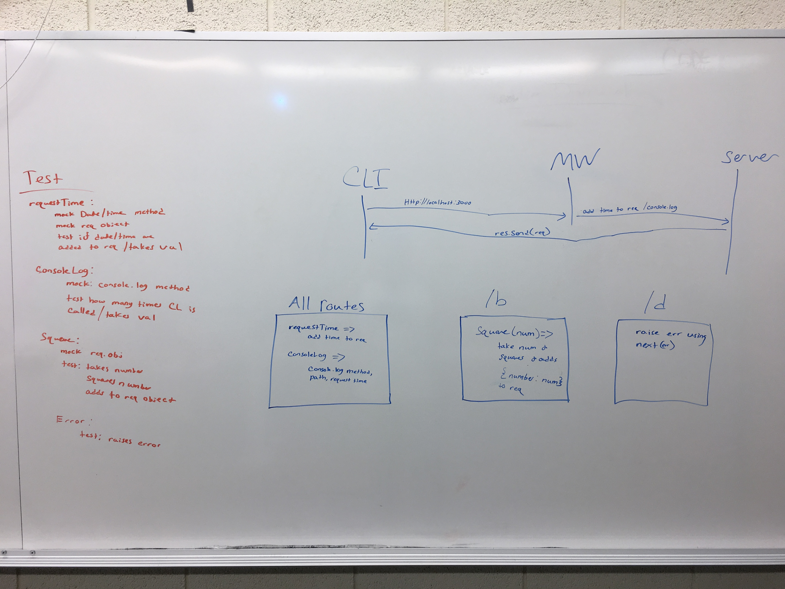

# Lab-07-api-server

## API server

### Author: Michael Chapman, Jeff Lawrence, Chloie

### Links and Resources
* [submission PR](https://github.com/michaelchapman-401-advanced-javascript/lab-07-api-server/pull/1)
* [travis](https://travis-ci.org/michaelchapman-401-advanced-javascript/lab-07-api-server)
*[Heroku](https://protected-eyrie-81414.herokuapp.com/)

### Modules
CRUD functions

#### Running the app
* `nodemon index.js`

  
#### Tests
* NPM test

